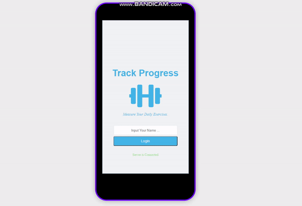

<h1 align="center">🕴️ Track Progress API (backend) 🕴️</h1>

> This is the backend repo for the full stack project - Track Progress App.

### ✨ [FrontEnd Files](https://github.com/Abhigyan001/track-progress-frontend/)

## Project Detail
- This app lets users track the daily progress made on their exercises. 
- The user can log in by entering their name and add individual measurements for each kind of exercise. 
- Users can keep track of their exercises by clicking the Records tab.
- Users can also update the activity as well as remove the activity. 
- Users can also update their profile by visiting the 'More' page.

## How To Use


### Tech Stacks
* Ruby On Rails
* Postgre
* Rspec

### Current Features
* CRUD for Users Model (get, post, put, delete);
* CRUD for Activities Model (get, post, put, delete);

### Planing Features
* User Authentication
* Add more models
* User could see their friend's progress

## Project Setup

### Prerequisite
* Ruby 2.6.6 or above;
* Rails 6.0.2.1

### Install

* Clone this repo:
  - Clone with SSH:
  ```
    git@github.com:Abhigyan001/track-progress-api.git
  ```
  - Clone with HTTPS
  ```
    https://github.com/Abhigyan001/track-progress-api.git
  ```

> Install Necessary Packages.
```sh
bundle install
```

> Create Database.
```sh
rails db:migrate
```


### Run Server

```sh
rails server
```

### Run tests

```sh
rspec
```

## Author

👤 **Abhigyan Mahanta**​

- Github: [@githubhandle](https://github.com/Abhigyan001)   
- Linkedin: [Linkedin Profile](https://www.linkedin.com/in/abhigyan001/)
- Twitter: [@Twitter](https://twitter.com/abhigyan_001)

## :handshake: Contributing

To contribute to this project:
- Fork this repository & clone locally.
- Create an upstream remote and sync your local copy.
- Create a new branch.
- Push your code to your origin repository.
- Create a new Pull Request.

## Show your support

Give a :star: if you like this project!

<!-- ACKNOWLEDGEMENTS -->
## Acknowledgements
* Design idea by [Gregoire Vella on Behance](https://www.behance.net/gregoirevella)
* [Microverse](https://www.microverse.org/)
* [Rails Api Documentation](https://api.rubyonrails.org/)
* [React Documentation](https://reactjs.org/docs/getting-started.html)
* [Heroku Documentation](https://devcenter.heroku.com/)

## 📝 License

This project is [MIT](https://opensource.org/licenses/MIT) licensed.
